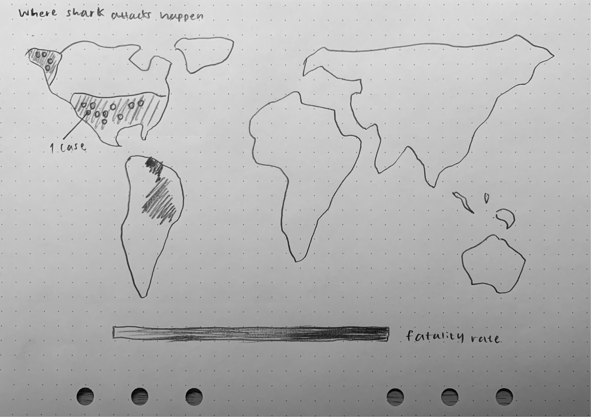
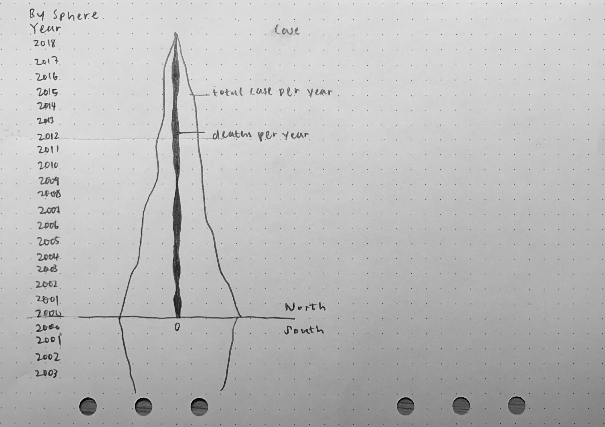
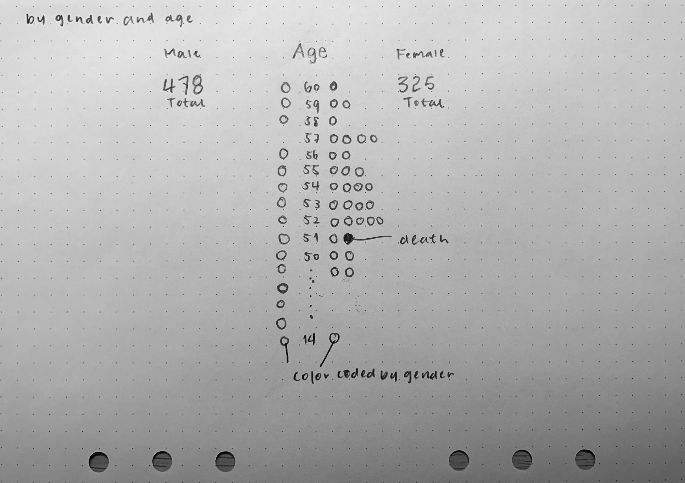
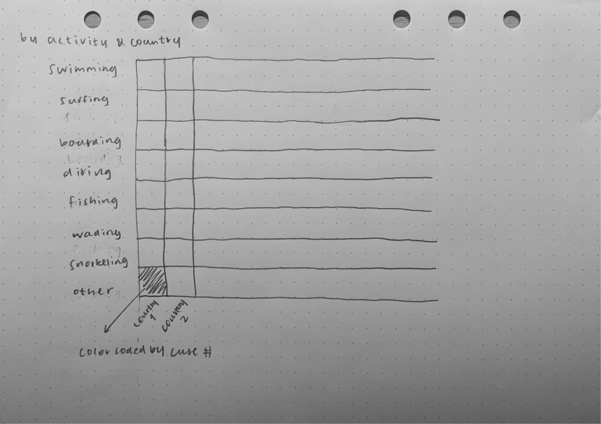

# Who Is More Dangerous
Data Visualization project to analyze shark attack and shart fish

## Data Sources
- [Shark Attacks By Activity](https://www.floridamuseum.ufl.edu/shark-attacks/factors/victim-activity/)

- [Shark Attack Summay 2019](https://www.floridamuseum.ufl.edu/shark-attacks/yearly-worldwide-summary/)

- [Shark Attacks Per Year](assets/data/total-shark-attacks-per-year.csv)

## Idealization

### World Map

### Sphere

### Gender Vs. Age

### Activity Vs. Country

